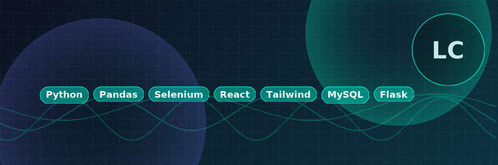

<!-- Banner (opcional): poné esta imagen en /assets/header.png -->

  

<h1 align="center">¡Hey! Soy Leandro “Lean” Cattai 👋</h1>

  Programador • Frontend & Data • Python | React | SQL — Mendoza, AR

  
  
  

---

### 🔎 Sobre mí
- 🚀 Desarrollo **frontend** moderno y **automatizaciones con Python** (Pandas, Selenium, Fast/Flask).
- 📊 Experiencia en **ciencia de datos** y **reporting** para call centers (Neotel, MySQL).
- 🧩 Me gustan las UI limpias, microinteracciones y performance.

### 🛠️ Tech stack principal

   
   
   
   
   
  
   
   
   
  

---

### ✨ Proyectos destacados
- 📈 **Automonitoreo Chiperas** — Script Python para **congestión** de dispositivos, conexión de agentes y **alertas por WhatsApp**.  
  `Pandas • Selenium • MySQL`
- ⚖️ **Colejus** — Frontend institucional con validaciones y generación de **boletas de pago** (integración backend Flask).  
  `React • Tailwind • Flask • Nginx`
- 🏢 **M&L Tech Website** — Landing minimalista con animaciones y dark/light mode.  
  `Flask • Tailwind • AOS`

> Tip: vinculá los repos reales acá cuando quieras.

---

### 📊 Stats (auto-actualizadas)

  
  

  

  

---

### 🧩 Qué estoy haciendo ahora
- 🔧 Mejoras en **validación de formularios** y generación de **boletas**.
- 🤖 Automatizaciones para **Neotel** y análisis operativo en tiempo real.
- 🧪 UI/UX con microinteracciones (Tailwind + HTMX/React).

📝 Contacto rápido

- Email: leandrocattai@gmail.com
- LinkedIn: [https://www.linkedin.com/in/leandro-cattai-rocher/]
- Portfolio:

---

  <i>Si llegaste hasta acá, ¡gracias por pasar! ⭐ Considerá dejar una star si algo te fue útil.</i>

